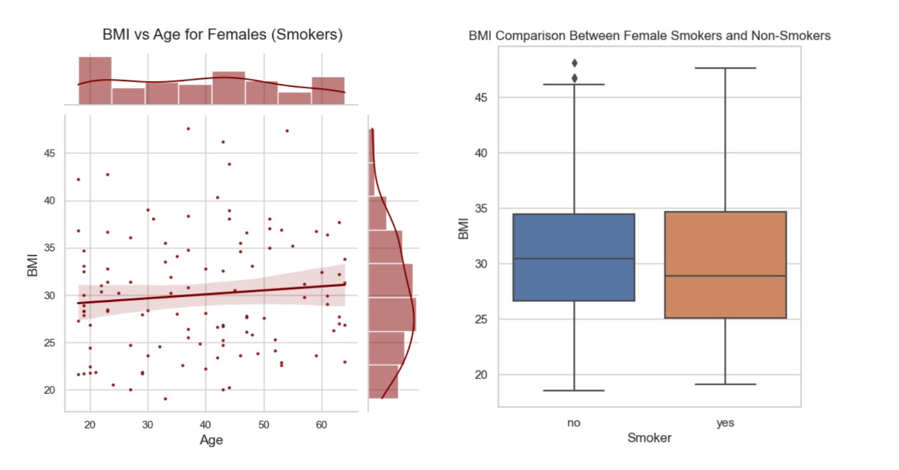

# Group 10 - Medical Expenses by Lifestyle and Age

Medical Expenses Across Different Lifestyles and Demographics 

## Milestones

Details for Milestone are available on Canvas (left sidebar, Course Project).

## Describe your topic/interest in about 150-200 words

Due to the fact that we are all residing in Canada (two team members are Canadian citizens), where health and medical costs are almost entirely covered by the government, we are interested in the fact that the United States, which is a first-world country, does not provide health care for its citizens.  We wanted to see how much higher medical expenses are for certain groups of people in the United States.  For instance, does a person's BMI significantly impact average medical costs?  What about smokers?  Our hunch is that smokers will indeed have higher expenses, but we are interested to see how much.  Lastly, we'd like to see how much medical expenses increase as people age.  Our hypothesis is that younger populations will have much lower medical costs compared to older populations.  The dataset would also allow us to explore how different geographic regions of the United States affect medical expenses, but while this is interesting, we will not look at this segment.

## Describe your dataset in about 150-200 words

Our dataset is insurance forecasts of medical expenses in the United States of America. The data was uploaded by Miri Choi 5 years ago but is derived from the book "Machine Learning with R" by Brett Lantz which was published in 2013. The data looks at medical expenses across age, sex, BMI, children, smoking, and region. The author did not explicitly say why they uploaded this dataset, but the book provides the dataset for students of R to practice machine learning methods using forecasted data.  We speculate it is also of public interest since medical expenses are a prominent issue in the United States where it is covered by private insurance and not by the government like in Canada.  The data was generated by a person who used linear regression to forecast the data. 

## Team Members

- David Ollech: I'm a 4th year student hoping to pursue an MBA in the future 
- Tong Phasutha-Ekkasit: I am a third year student in the Management program focusing on accounting and finance.

## Images

## References

https://www.kaggle.com/datasets/mirichoi0218/insurance

