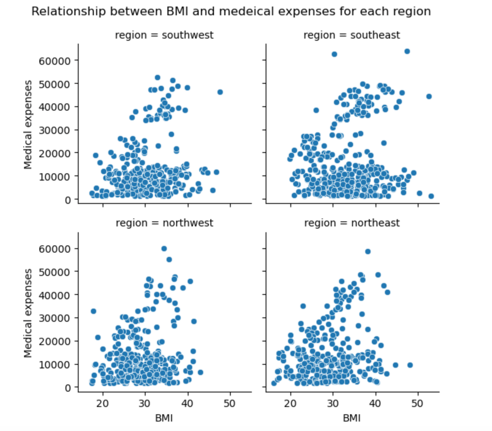

# Final Report
### Introduction

Our project set out to answer two question: 1.) What effect does smoking have on an individual's BMI as they age, and 2.) How do the medical expenses of an obese female with children, aged 20-35, differ in each region compared to a female age 36 - 50.  Our dataset compiled information on age, smoking status, number of children, BMI, and geographical regions in the United States. We felt a dataset that focused on health issues and medical expenses (especially in the US) was interesting, partly because we are residing in Canada where medical expenses are covered by the government.  We also thought the idea was interesting that smoking, which has a host of bad health effects, could actually have a positive effect (that is, keeping a person's BMI lower).

### Exploratory Data Analysis

The following is Tong's EDA that show the relationship between BMI and medical expenses for each region. This visualization is for both males and females with all ages and all types of BMI from under weight to obesity.

