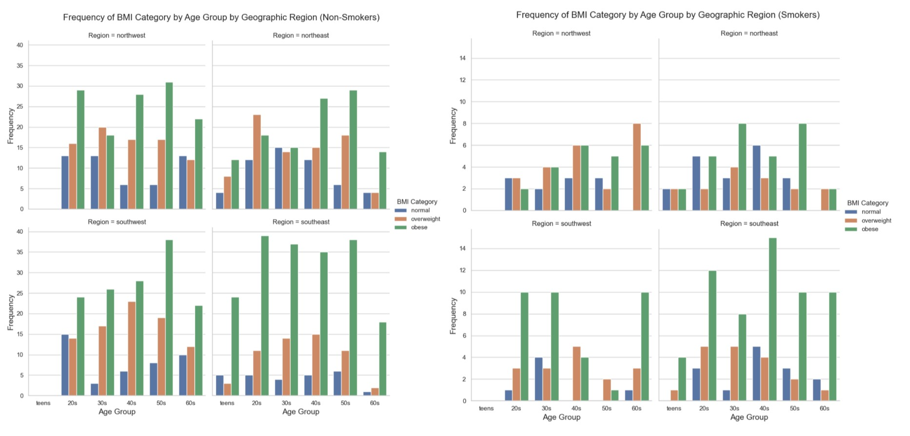
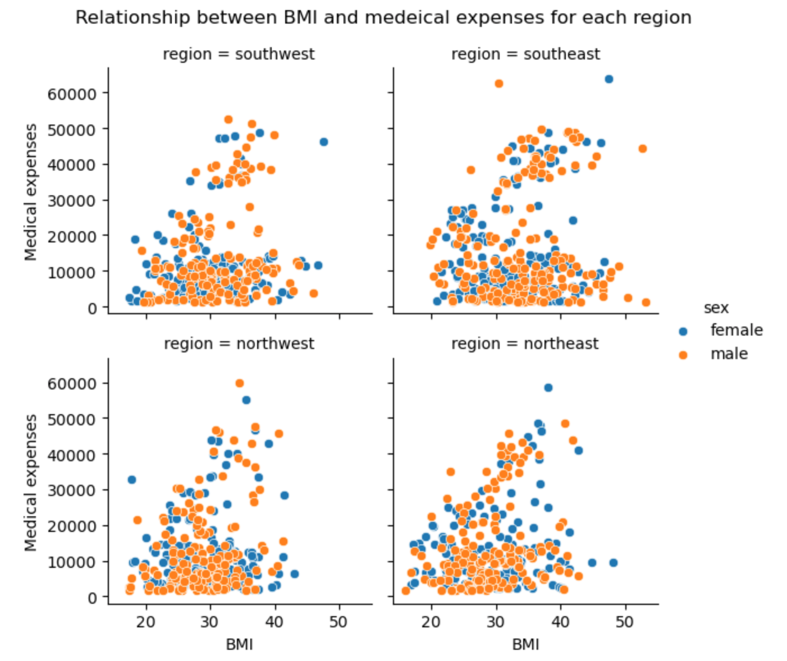
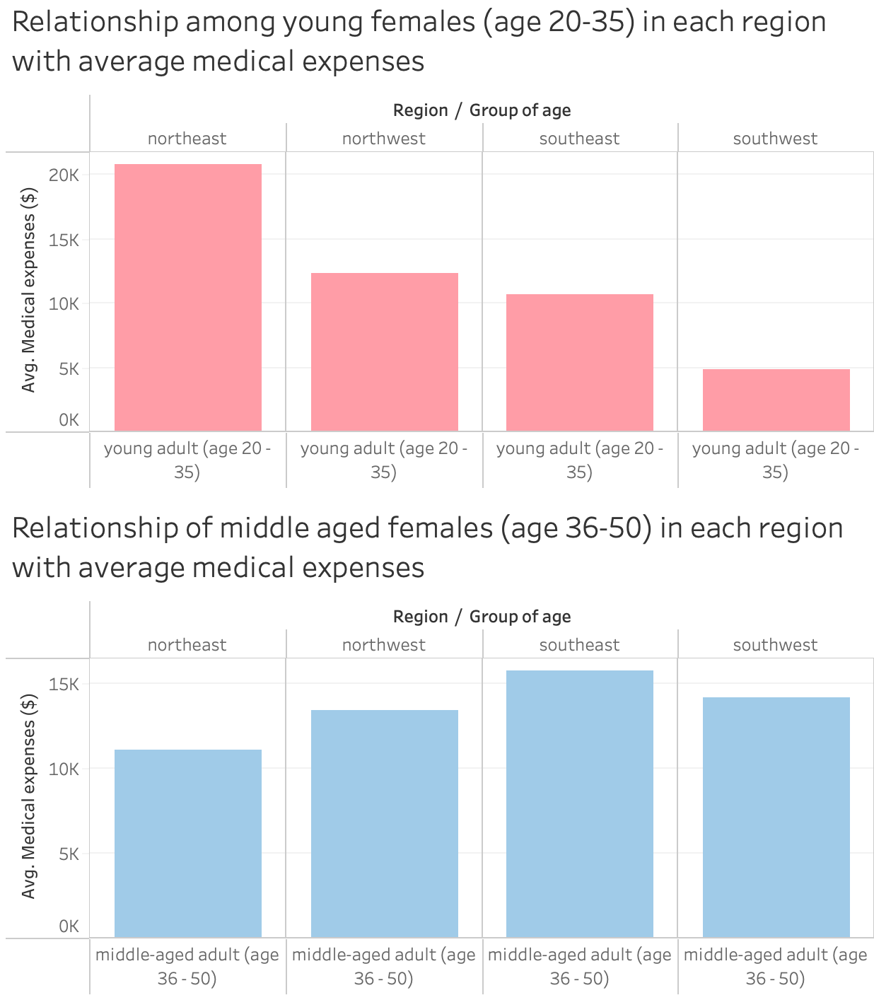
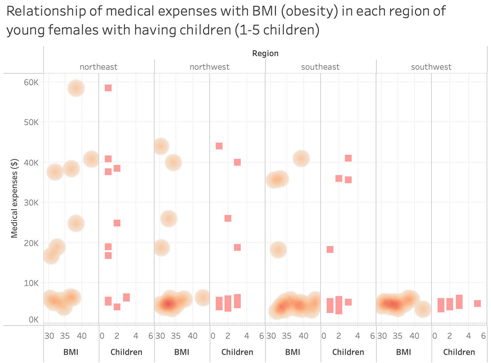
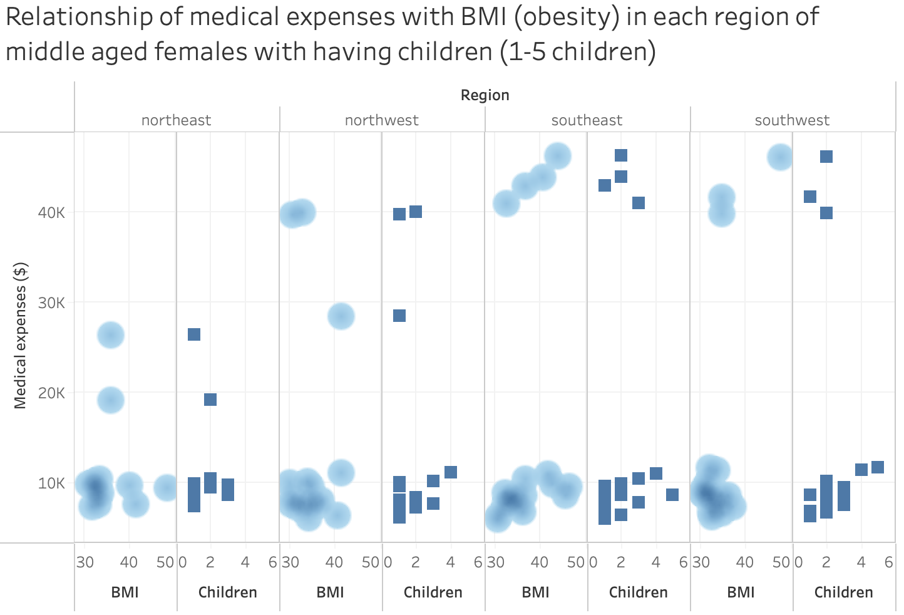

# Final Report
### Introduction

Our project set out to answer two question: 1.) What effect does smoking have on an individual's BMI as they age, and 2.) How do the medical expenses of an obese female with children, aged 20-35, differ in each region compared to a female age 36 - 50.  Our dataset compiled information on age, smoking status, number of children, BMI, and geographical regions in the United States. We felt a dataset that focused on health issues and medical expenses (especially in the US) was interesting, partly because we are residing in Canada where medical expenses are covered by the government.  We also thought the idea was interesting that smoking, which has a host of bad health effects, could actually have a positive effect (that is, keeping a person's BMI lower).

### Exploratory Data Analysis

At the outset of my EDA, I was looking at the relationships between smoking, gender, region, and BMI.  Nothing interested presented itself until I looked at the relationship between smoking and BMI and I realized that it looked like smokers did not increase their BMI as they aged, compared to non-smokers who did.

The following is my EDA that shows the relationship between BMI and medical expenses for each region. This visualization is for both males and females with all ages and all types of BMI from under weight to obesity.

### Question 1 + Results

### Question 2 + Results

**Questions: How does female in age 20-35 with obesity (bmi >30) with children in each region have different medical expenses compared to female in age 36-50 with obesity with children in each region?**

According to the two bar graphs above, I have noticed that, overall, the average medical expenses seem to increase when females located in northwest, southeast, and southwest age, but there is only one region which is northeast that presents the opposite way. 

To be more specific, this visualization of young females has presented BMI, so I can see that a higher BMI does not always present higher medical expenses. Besides, having a lower BMI tends to have lower medical expenses. Considering the available data, I can see that number of children between 1 and 5 is not related to how low or high of BMI is.  

This visualization of middle-aged females has presented BMI as well, so I can see from available data that a higher BMI does not always present higher medical expenses for middle-aged females as I have noticed from young females' visualizations above. Besides, having a lower BMI tends to have lower medical expenses, noticing the density of lower BMI again as well. 

However, if I look at the two latest visualizations, I notice that, according to the available data, there are no high medical expenses for both young females and middle-aged females with 4 or 5 children. It is more likely that females from age 20-35 and age 36-50 would have high medical expenses with 1 or 2 children. 

### Summary/Conclusion
The key findings from our report was that individual's that smoke have a lower BMI than individuals that do not, and that a lower BMI correlates with lower medical expenses, though that can be counteracted by children and age.  We learned the answers to our research questions, which were 1.) That individual's who smoke can expect a surprising benefit from an otherwise unhealthy activity: that it helps decrease a person's BMI as they age. 2.) We learned that women with lower BMIs experience lower medical expenses, but that regardless of BMI, based on available data, having one or two children can increase medical expenses.